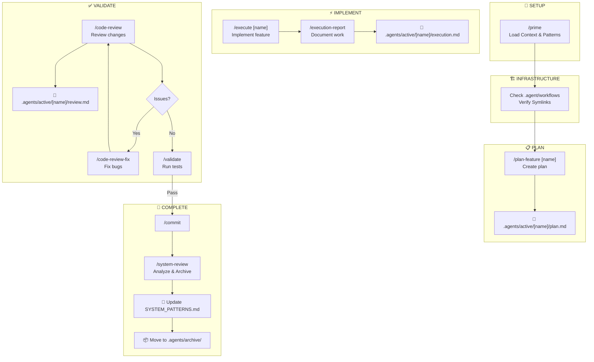

# Claude Commands Workflow Guide (v2)

This document describes the "Feature-Centric" workflow for AI development, combining systematic planning with structured execution.

> **Key Change (v2)**: Artifacts are now grouped by **Feature**, not by file type. This keeps all context (plan, execution, review) in one place.

---

## 🎯 The PIV Development Loop (v2)

**P**lan → **I**mplement → **V**alidate

This is an iterative cycle that ensures quality code through systematic planning, execution, and validation.



---

## 📖 Command Reference

### Phase 0: Setup & Infrastructure

```
┌─────────────────────────────────────────────────────────────────┐
│  /prime                                                         │
├─────────────────────────────────────────────────────────────────┤
│  PURPOSE: Load project context and memory                       │
│                                                                 │
│  WHEN TO USE:                                                   │
│  • Starting work in a new/unfamiliar codebase                   │
│  • Beginning a new development session                          │
│                                                                 │
│  ACTIONS:                                                       │
│  1. Read CLAUDE.md (or AGENTS.md)                               │
│  2. Read .agents/SYSTEM_PATTERNS.md (Critical!)                 │
│  3. Verify .agent/workflows/ symlinks (Essential!)              │
│     (Must point to .opencode/commands/*.md)                     │
│  4. Check .agents/active/ for ongoing work                      │
└─────────────────────────────────────────────────────────────────┘
```

---

### Phase 1: Planning

```
┌─────────────────────────────────────────────────────────────────┐
│  /plan-feature [feature-name]                                   │
├─────────────────────────────────────────────────────────────────┤
│  PURPOSE: Create comprehensive implementation plan              │
│                                                                 │
│  EXAMPLE:                                                       │
│  /plan-feature add-user-auth                                    │
│                                                                 │
│  WHAT IT DOES:                                                  │
│  1. Creates directory: .agents/active/[feature-name]/           │
│  2. Analyzes codebase for patterns and conventions              │
│  3. Identifies files to create/modify                           │
│  4. Creates step-by-step implementation tasks                   │
│                                                                 │
│  OUTPUT:                                                        │
│  📁 .agents/active/[feature-name]/plan.md                       │
│                                                                 │
│  ⚠️  NO CODE IS WRITTEN IN THIS PHASE                           │
└─────────────────────────────────────────────────────────────────┘
```

---

### Phase 2: Implementation

```
┌─────────────────────────────────────────────────────────────────┐
│  /execute [feature-name]                                        │
├─────────────────────────────────────────────────────────────────┤
│  PURPOSE: Implement the plan step-by-step                       │
│                                                                 │
│  TARGET:                                                        │
│  📁 .agents/active/[feature-name]/plan.md                       │
│                                                                 │
│  WHAT IT DOES:                                                  │
│  1. Reads the plan from the active feature folder               │
│  2. Executes tasks in dependency order                          │
│  3. Validates after each task                                   │
└─────────────────────────────────────────────────────────────────┘

                              ⬇️

┌─────────────────────────────────────────────────────────────────┐
│  /execution-report                                              │
├─────────────────────────────────────────────────────────────────┤
│  PURPOSE: Document what was implemented                         │
│                                                                 │
│  WHAT IT CAPTURES:                                              │
│  • Files added/modified                                         │
│  • Validation results                                           │
│  • Challenges encountered                                       │
│                                                                 │
│  OUTPUT:                                                        │
│  📁 .agents/active/[feature-name]/execution.md                  │
└─────────────────────────────────────────────────────────────────┘
```

---

### Phase 3: Validation

```
┌─────────────────────────────────────────────────────────────────┐
│  /code-review                                                   │
├─────────────────────────────────────────────────────────────────┤
│  PURPOSE: Technical review of changes                           │
│                                                                 │
│  OUTPUT:                                                        │
│  📁 .agents/active/[feature-name]/review.md                     │
└─────────────────────────────────────────────────────────────────┘

          ⬇️ If issues found...

┌─────────────────────────────────────────────────────────────────┐
│  /code-review-fix [feature-name] [scope]                        │
├─────────────────────────────────────────────────────────────────┤
│  PURPOSE: Fix bugs found in code review                         │
│                                                                 │
│  WHAT IT DOES:                                                  │
│  1. Reads the review file                                       │
│  2. Fixes each issue one by one                                 │
│  3. Runs validation                                             │
└─────────────────────────────────────────────────────────────────┘

          ⬇️ After fixes or if no issues...

┌─────────────────────────────────────────────────────────────────┐
│  /validate                                                      │
├─────────────────────────────────────────────────────────────────┤
│  PURPOSE: Run comprehensive validation suite                    │
│                                                                 │
│  RUNS:                                                          │
│  1. Linting checks (npm run lint)                               │
│  2. Build verification (npm run build)                          │
│  3. Unit tests (if configured)                                  │
└─────────────────────────────────────────────────────────────────┘
```

---

### Phase 4: Completion & Archiving

```
┌─────────────────────────────────────────────────────────────────┐
│  /commit                                                        │
├─────────────────────────────────────────────────────────────────┤
│  PURPOSE: Create atomic commit with conventional message        │
└─────────────────────────────────────────────────────────────────┘

          ⬇️ Required for cleanup...

┌─────────────────────────────────────────────────────────────────┐
│  /system-review                                                 │
├─────────────────────────────────────────────────────────────────┤
│  PURPOSE: Meta-analysis and Archiving                           │
│                                                                 │
│  ACTIONS:                                                       │
│  1. Analyzes process (Plan vs Execution)                        │
│  2. Updates .agents/SYSTEM_PATTERNS.md with new learnings       │
│  3. Creates .agents/active/[name]/system-review.md              │
│  4. Moves folder:                                               │
│     mv .agents/active/[name] .agents/archive/[name]             │
└─────────────────────────────────────────────────────────────────┘
```

---

## 📂 Directory Structure

```
.agent/                      # [SYSTEM] Workflow hooks
│   └── workflows/           # Symlinks to commands (Essential)
.opencode/                   # [SYSTEM] Configuration & Commands
│   ├── commands/            # Command source definitions
│   ├── opencode.json        # Config
│   └── reference/           # Project docs
.agents/                     # [MEMORY] Agent Memory
├── SYSTEM_PATTERNS.md       # Long-term shared memory
├── active/                  # Features currently in progress
└── archive/                 # Completed features (Reference only)
```

---

## 🧠 Sequential Thinking Integration

### Overview

The PIV workflow is enhanced by **Sequential Thinking MCP** (Model Context Protocol). This works **transparently** within existing workflow commands.

### When Sequential Thinking Activates (Automatically)

The AI assistant automatically uses Sequential Thinking when encountering:

#### During `/plan-feature`:
- **Complex architectural decisions**
- **Data model design**
- **Security considerations**
- **Multiple valid approaches**

#### During `/execute`:
- **Complex algorithm implementation**
- **Asynchronous logic**
- **Error handling design**

#### During `/system-review`:
- **Analyzing why divergence from plan occurred**
- **Identifying patterns in recurring bugs**

### What You See (As a User)

**You don't see the thinking process** unless you specifically ask for it. You see:

✅ **Better quality plans** with thorough consideration of trade-offs  
✅ **Cleaner code** with fewer edge-case bugs  
✅ **More accurate debugging** with faster root cause identification  

### File Artifacts Remain the Source of Truth

**Critical:** Sequential Thinking operates in-memory during AI reasoning. **All final outputs are still saved as files** in the `.agents/active/` or `.agents/archive/` directories.

---

## 💡 Quick Reference

| Phase | Command | Output Location |
|-------|---------|-------------|
| Setup | `/prime` | N/A |
| Plan | `/plan-feature [name]` | `.agents/active/[name]/plan.md` |
| Implement | `/execute [name]` | Code + Tests |
| Implement | `/execution-report` | `.agents/active/[name]/execution.md` |
| Validate | `/code-review` | `.agents/active/[name]/review.md` |
| Archive | `/system-review` | Moves to `.agents/archive/[name]/` |

---

## 🎯 Best Practices

1.  **Feature Isolation**: Keep all files for a feature in its specific folder in `active/`.
2.  **Memory First**: Always check `SYSTEM_PATTERNS.md` before solving a "new" bug.
3.  **Archive Aggressively**: Once a feature is deployed and working, run `/system-review` to move it to archive. Keep `active/` clean.
